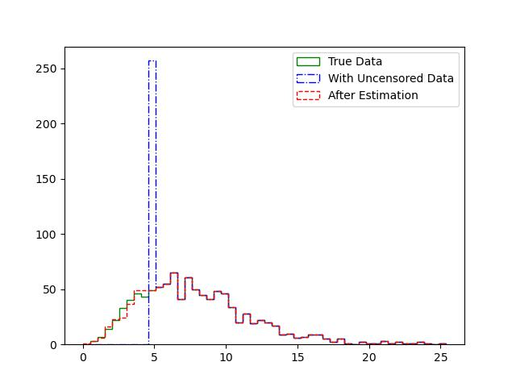

# Leftcensored_Estimator
	

An attempt to extensively and simply use MLE and Kaplan-Meier method to impute left-censored data samples.

## Description

In environmental monitoring, the observation value below the limit of detection is a common phenomenon. Generally, environmental monitoring datasets are left-censored. In viewing the current research, some parametric or non-parametric methods such as Maximum Likelihood Estimation and Kaplan-Meier have been widely adopted in estimating the
mean, median, and standard deviation of the whole dataset. 

Here is an attempt to extensively use these methods to generate values for those left-censored data. As the generated values follow the probable distribution of the original dataset, it may be more reasonable to adopt them in quantitative research than simply applying the estimation results from the widely adopted 0.5 * LOD substitution method (Pleil, 2016).

## Major Dependencies

1. scipy 1.13.1 (class "CensoredData" is required)
2. numpy
3. lifelines

## Maximum Likelihood Estimation (MLE)

For the MLE method, when an assumed distribution is given, the most probable parameter of the distribution can be estimated. A certain probability density function can be obtained. A random value generator follows the estimated distribution and is then adopted to impute the left-censored sample. According to Shoari et al. (2015), the gamma distribution as a prior distribution for MLE is robust to environmental data, which is usually with high skewness. It was also recommended to be adopted in MLE. Therefore, the current implementation has an assumption that the dataset can be fitted by a gamma distribution.

With a unique LOD:

With various LODs:

## Kaplan-Meier Method (KM)

The KM method derives from survival curve analysis. In environmental studies, it has been adopted in estimating the mean, median, and standard deviation of a censored dataset (Tekindal et al., 2017). It does not require a prior assumption of the distribution of the dataset. In this case, I use the KM method to estimate the "survival curve" of a left-censored dataset. The left-censored samples are then estimated using a random number generator, which competes with the survival curve. For a given left-censored data sample in [0~LOD], a random location is generated first. Subsequently, another random value is generated and used to compare with the survival ratio at the corresponding location on the survival curve obtained by the KM method. If the random value is higher than the survival ratio, the selected location is then selected. Otherwise, this process will be iteratively performed until a final location is determined. The location with a lower survival ratio will have a higher possibility of being selected. As the KM method will be equivalent to a simple substitution when there is only a unique LOD value (Tekindal et al., 2017), this implementation will be equivalent to left-censored samples using a pure random value generator.

As I'm new to the KM method, the appropriateness of this implementation still needs to be discussed.

With a unique LOD:

With various LODs:

## Reference

1. Joachim, P., 2016. Imputing defensible values for left-censored ‘below level of quantitation’ (LoQ) biomarker measurements. Journal of Breath Research 10 (2016) 045001.
2. Niloofar, S., Jean-Sébastien, D., Shoja’eddin C., 2015.  Estimating the mean and standard deviation of environmental data with below detection limit observations: Considering highly skewed data and model misspecification. Chemosphere 138 (2015) 599-608. 
3. Mustafa, T., Beyza E., Yasemin Y. (2017). Evaluating Left-Censored Data Through Substitution, Parametric, Semi-parametric, and Nonparametric Methods: A Simulation Study. Interdiscip Sci Comput Life Sci.  https://doi.org/10.1007/s12539-015-0132-9.